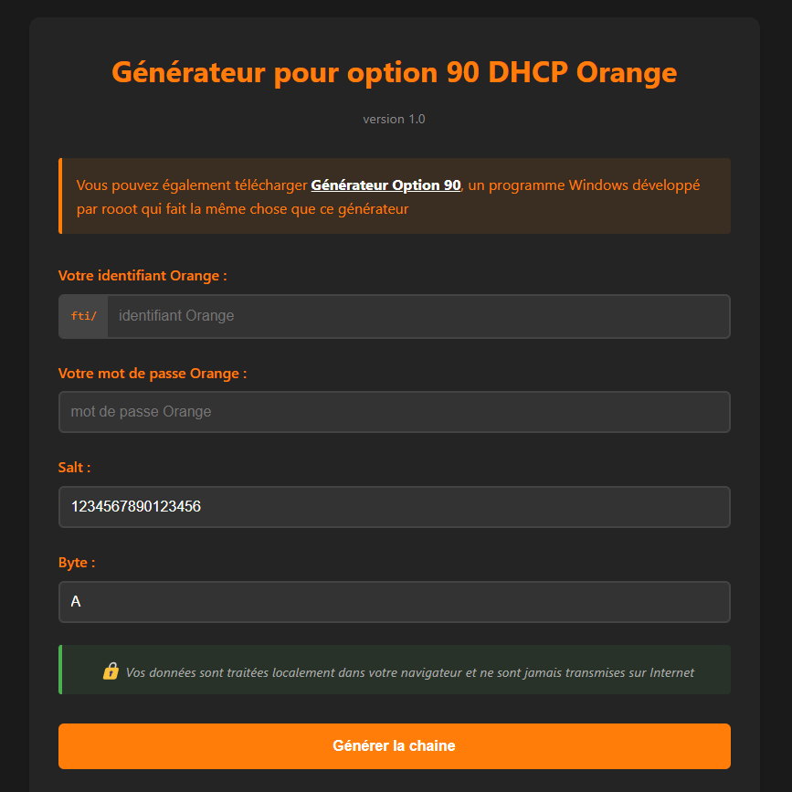
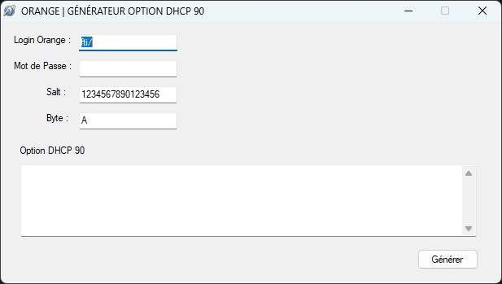

# Générateur Option 90 DHCP Orange

Un outil web simple pour générer la chaîne option 90 DHCP nécessaire pour se connecter au réseau Orange sans utiliser la Livebox.

## Captures d'écran

### Version Web

### Version Windows

## Fonctionnalités

- Génération de l'option 90 DHCP à partir de vos identifiants Orange
- Traitement entièrement local (aucune donnée n'est envoyée sur Internet)
- Interface simple et intuitive
- Boutons de copie pour faciliter l'utilisation des paramètres
- Instructions de configuration pour pfSense

## Version en ligne

Une version en ligne de cet outil est disponible à l'adresse suivante :
[https://painteau.github.io/OrangeDHCP/](https://painteau.github.io/OrangeDHCP/)

Cette version web vous permet d'utiliser l'application directement dans votre navigateur sans avoir besoin de l'installer.

Vous pouvez également télécharger directement le programme exécutable pour Windows depuis le dépôt via le fichier [generateur_option_90.zip](generateur_option_90.zip).

## Utilisation

1. Entrez votre identifiant Orange (sans le préfixe "fti/")
2. Entrez votre mot de passe Orange
3. Laissez les valeurs par défaut pour "Salt" et "Byte" (sauf si vous savez ce que vous faites)
4. Cliquez sur "Générer la chaîne"
5. Copiez la chaîne générée pour l'utiliser dans votre configuration DHCP

## Fonctionnement technique

La génération de l'option 90 DHCP suit un algorithme spécifique imposé par Orange :

1. La chaîne commence par un préfixe fixe : `00:00:00:00:00:00:00:00:00:00:00:1a:09:00:00:05:58:01:03:41`
2. Ensuite, l'identifiant Orange est encodé avec le préfixe "fti/" :
   - Le type (01) et la longueur de l'identifiant sont ajoutés
   - Chaque caractère est converti en hexadécimal et séparé par des deux-points
3. Le "Salt" (une chaîne de 16 caractères) est ajouté avec son type (3c) et sa longueur
4. Le "Byte" (généralement "A") est ajouté avec son type (03)
5. Enfin, un hachage MD5 est calculé à partir de la combinaison du Byte, du mot de passe et du Salt
6. Ce hachage est formaté en hexadécimal avec des deux-points entre chaque octet

Cette méthode reproduit exactement le calcul effectué par la Livebox d'Orange, permettant ainsi d'utiliser votre propre routeur tout en s'authentifiant correctement sur le réseau Orange.

Pour une explication technique détaillée de l'algorithme, consultez le fichier [TECHNICAL_DOCUMENTATION.md](TECHNICAL_DOCUMENTATION.md) inclus dans ce dépôt.

## Configuration pfSense

Le générateur inclut les paramètres nécessaires pour configurer pfSense :

- **VLAN tag**: 832
- **Send options**: 
  - dhcp-class-identifier: "sagem"
  - user-class: "+FSVDSL_livebox.Internet.softathome.Livebox4"
  - option-90: (la chaîne générée)
- **Request options**: subnet-mask, broadcast-address, dhcp-lease-time, dhcp-renewal-time, dhcp-rebinding-time, domain-search, routers, domain-name-servers, option-90
- **Option modifiers**: vlan-pcp: 6

## Installation locale

1. Téléchargez ou clonez ce dépôt
2. Ouvrez le fichier `index.html` dans votre navigateur
3. C'est tout !

Aucun serveur web n'est nécessaire, l'application fonctionne entièrement dans votre navigateur.

Vous pouvez également utiliser directement la [version en ligne](https://painteau.github.io/OrangeDHCP/) sans installation.

## Alternative Windows

Une version Windows de cet outil est disponible sous forme d'application exécutable, développée par rooot. Vous pouvez la télécharger directement depuis ce dépôt via le fichier [generateur_option_90.zip](generateur_option_90.zip) ou depuis l'application web.

## Sécurité

Toutes les opérations sont effectuées localement dans votre navigateur. Vos identifiants ne sont jamais transmis sur Internet.

## Sources et crédits

- [JSFiddle Original](https://jsfiddle.net/kgersen/3p854b9e/) par kgersen, auteur du script original
- [LaFibre.info - Contrôle Option 90](https://lafibre.info/remplacer-livebox/durcissement-du-controle-de-loption-9011-et-de-la-conformite-protocolaire/)
- [LaFibre.info - Système Option 90](https://lafibre.info/remplacer-livebox/cacking-nouveau-systeme-de-generation-de-loption-90-dhcp/)
- Programme Windows développé par rooot

## Licence

Ce projet est distribué sous licence MIT. Voir le fichier LICENSE pour plus de détails. 
